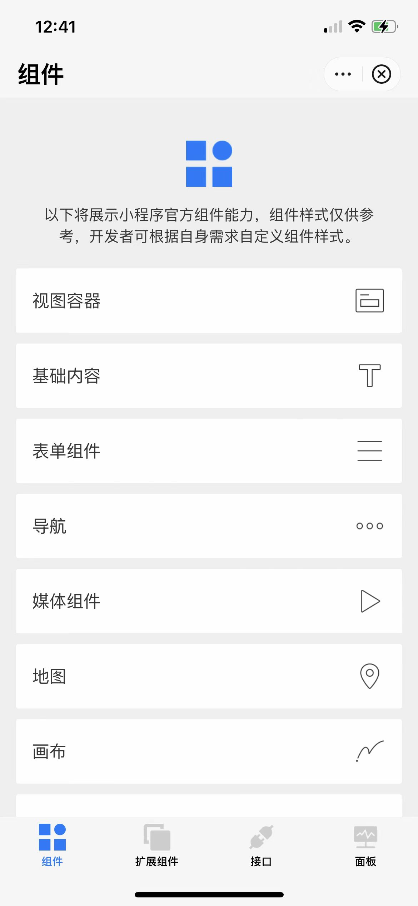

# Smart MiniApp Demo

[English](README.md) | [中文版](README_cn.md)

Smart miniApp demo source code, welcome to use Smart Life APP to scan the code.


## Get Started

```shell
yarn add
or
npm i
```

After completing the above steps, use the Smart miniApp Developer Tool to import the project and open it.

## Questions

If you have bug feedback or any other suggestions, please submit an issue to us.

## Screenshot


