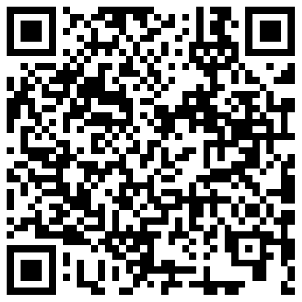

# 智能小程序示例

[English](README.md) | [中文版](README_cn.md)

智能小程序示例源码，欢迎使用智能生活 APP 扫码体验。



## 快速开始

```shell
yarn add
or
npm i
```

完成上述步骤后，使用智能小程序开发者工具导入项目并打开。

## 相关文档

了解更多智能小程序框架、组件、API和教程，请查看：

智能小程序官方文档: https://developer.tuya.com/cn/miniapp

## 问题

如果你有 bug 反馈或其他任何建议，欢迎提 issue 给我们。

## 截图


## 许可证

详细信息请查看 [LICENSE](LICENSE) 文件。
