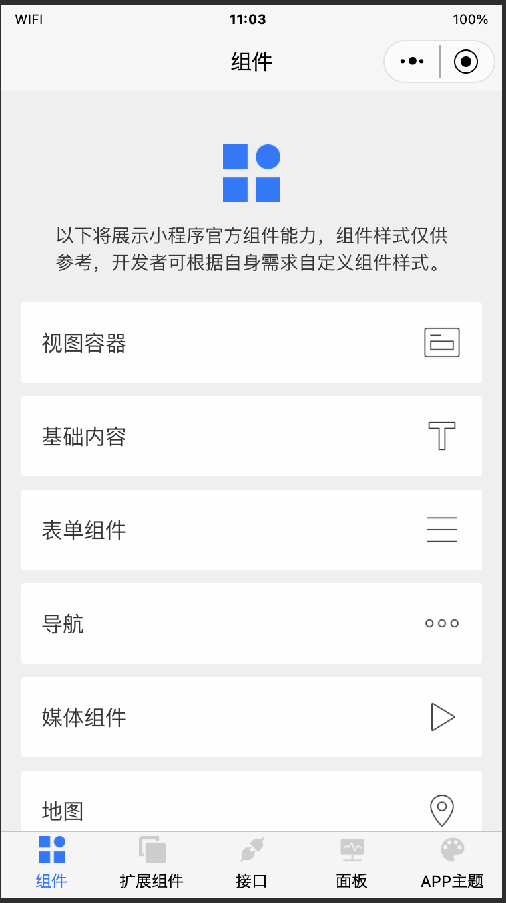

# 智能小程序示例

[English](README.md) | [中文版](README_cn.md)

智能小程序示例源码，欢迎使用智能生活 APP 扫码体验。


## 使用

```shell
yarn add
or
npm i
```

完成上述步骤后，使用智能小程序开发者工具导入项目并打开。

## 问题

如果你有 bug 反馈或其他任何建议，欢迎提 issue 给我们。

## 截图


